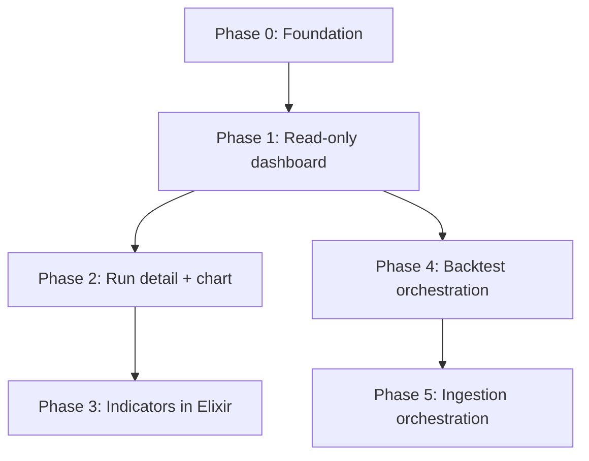
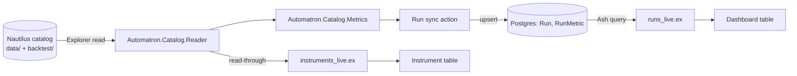

# Design: Foundation + Read-only Dashboard (Phase 0+1)

**Date:** 2026-06-03
**Project:** `nautilus_automatron_ex` — Elixir/Ash/Phoenix LiveView rewrite of `nautilus_automatron`
**Status:** Approved for planning

## Purpose

Rewrite the `nautilus_automatron` backtest-analysis app in Elixir to learn Elixir,
the BEAM/OTP, Ash, and Phoenix LiveView. This spec covers the first slice:
a working app, running on the real NautilusTrader catalog, that browses backtest
runs with their metrics and the available instrument data.

NautilusTrader itself is **not** rewritten. It remains an external Python engine
that produces the catalog. This Elixir app reimplements `nautilus_automatron`:
the part that visualises and (in later phases) creates/manages backtests.

## Scope

### In scope (this phase)

- New Phoenix/Ash project skeleton with Postgres, Oban, and Explorer wired in.
- Explorer-based reader for the NautilusTrader catalog (`data/` and `backtest/`).
- Postgres-backed Ash read-model (`Run`, `RunMetric`) populated by a `sync` action.
- Pure Elixir port of the run-metrics computation.
- Two LiveView pages: runs dashboard and instrument catalog.
- Config to point at the real catalog; tests; metrics parity with the Python app.

### Out of scope (later phases)

- Run-detail page and candlestick chart (Phase 2).
- Indicators reimplemented in Elixir (Phase 3).
- Backtest creation/rerun/delete orchestration (Phase 4).
- IB data-ingestion orchestration (Phase 5).

## Background: who owns what

The NautilusTrader catalog is written by **NautilusTrader**, not by automatron:

| Catalog dir | Contents | Written by |
|---|---|---|
| `data/` | Input market data (bars, instruments), Parquet | NautilusTrader `ParquetDataCatalog.write_data()`, driven by automatron's `data/` + `migrate.py` |
| `backtest/{run_id}/` | Run output: `order_filled`, position events, `account_state`, `config.json`, feather | NautilusTrader via `StreamingConfig(catalog_path=...)` during `BacktestNode.run()` |

Elixir can **read** these Parquet/feather files natively (Explorer/Polars) but
cannot **produce** a backtest catalog without running NautilusTrader (Python).
That constraint shapes the whole rewrite: Elixir reads and orchestrates; Python
runs the engine.

## Locked architectural decisions (whole project)

These were decided during brainstorming and govern all phases, not just this one.

| # | Decision | Choice | Rationale |
|---|---|---|---|
| 1 | Rewrite scope | Reimplement automatron (dashboard + run orchestration + ingestion orchestration). NautilusTrader stays external Python. | Engine is Python/Cython-bound; rewriting it is out of scope and not the learning goal. |
| 2 | Python boundary | One-shot jobs spawned as supervised OS processes via `Exile`/`MuonTrap`; JSON-line progress on stdout → `Phoenix.PubSub` → LiveView; durability/retries via Oban. | Backtests/downloads are one-shot batch jobs — the textbook case for spawned, monitored processes. Teaches Ports, supervision, PubSub, Oban. Avoids a second always-on server. |
| 3 | Catalog reads | Explorer (native Parquet/Arrow IPC). No Python on the read path. | Idiomatic, fast; teaches Explorer/Series. |
| 4 | Indicators | Reimplement in Elixir as pure functions over bar series. | Logic is automatron-owned or standard math, only loosely tied to Nautilus's `Bar` type. Largest porting surface → its own phase. |
| 5 | Charting | Reuse the existing eCharts library via a LiveView JS hook; the Elixir backend produces the same data payload shape the current client expects. | Reuse charting knowledge; teaches hooks + the server/client boundary. |

## Phase roadmap (context)



This spec = **Phase 0 + Phase 1**, written as one buildable slice.

## Architecture (this phase)

```
lib/
  automatron/
    catalog/                  # Explorer-based catalog reader (pure, no Ash)
      reader.ex               # list_run_ids, read_run_config, read_positions_closed,
                              #   read_fills, list_instrument_data
      metrics.ex              # pure run-metrics computation over an Explorer dataframe
    runs/                     # Ash domain
      run.ex                  # Ash resource (AshPostgres) — one row per backtest run
      run_metric.ex           # metric fields (embedded in Run or 1:1 resource)
      sync.ex                 # sync action: scan catalog -> upsert Run + RunMetric
    instruments/
      instrument_data.ex      # Ash resource, read-through (manual action over reader)
  automatron_web/
    live/
      runs_live.ex            # "/"            dashboard: runs list + Sync button
      instruments_live.ex     # "/instruments" instrument catalog
config/                       # CATALOG_PATH, repo, Oban
priv/repo/migrations/         # Run / RunMetric tables
```

Stack: Phoenix + LiveView, Ash, AshPostgres (Postgres), Oban (scaffolded this
phase, first used in Phase 4), Explorer. Oban and Postgres are wired now so later
phases do not re-scaffold infrastructure.

### Data flow



## Components

### 1. `Automatron.Catalog.Reader` (pure)

No Ash dependency. Mirrors the Python `catalog_reader` + `reader`.

- `list_run_ids(catalog_path) :: [String.t()]` — directory names under `backtest/`.
- `read_run_config(catalog_path, run_id) :: map` — parse `backtest/{run_id}/config.json`.
- `read_positions_closed(catalog_path, run_id) :: Explorer.DataFrame.t()` —
  read `position_closed_0.feather`; project `realized_pnl`, `ts_opened`,
  `ts_closed`, `duration_ns`.
- `read_fills(catalog_path, run_id) :: Explorer.DataFrame.t()` — read
  `order_filled_0.feather` (count + later detail).
- `list_instrument_data(catalog_path) :: [map]` — scan `data/`; per bar_type
  return `instrument_id`, `bar_type`, `bar_count`, `ts_min`, `ts_max`,
  `file_count`, `path`. Plus `timeframe` and `venue` parsed from `bar_type`
  (port of `_parse_timeframe` / `_parse_venue`).

**Dependency:** the filesystem catalog at `CATALOG_PATH`. **Contract:** returns
dataframes/maps; no DB, no web concerns.

### 2. `Automatron.Catalog.Metrics` (pure)

Port of `server/store/metrics.py`. Input: closed-positions dataframe. Output: a
map with exactly these keys (parity with the Python app):

`total_pnl, win_rate, expectancy, sharpe_ratio, avg_win, avg_loss,
win_loss_ratio, wins, losses, avg_hold_hours, pnl_per_week, trades_per_week`

Rules ported verbatim:
- `total_pnl` = sum of `realized_pnl`, rounded 2dp.
- wins = `pnl > 0`; losses = `pnl <= 0`.
- `win_rate` = wins / total, 4dp.
- `avg_win` / `avg_loss` = mean of each group (nil when group empty).
- `win_loss_ratio` = `abs(avg_win / avg_loss)`, nil if `avg_loss` is nil/zero.
- `expectancy` = `win_rate*avg_win - (1-win_rate)*abs(avg_loss)`, 2dp.
- `sharpe_ratio` = group `realized_pnl` by calendar month (UTC, via `ts_closed`),
  sum per month, `mean / sample_std * sqrt(12)`; nil if < 2 months or std == 0.
- `pnl_per_week` / `trades_per_week` use run span weeks =
  `(max ts_closed - min ts_opened) / ns_per_week`.
- Zero positions → all-nil metrics map (port of `empty_metrics`).

**Contract:** pure function, no I/O. This is the most-tested unit (parity is the
phase's success criterion).

### 3. Ash resources

- **`Run`** (AshPostgres): `run_id` (primary, string), `trader_id`, `strategy`,
  `total_positions`, `total_fills`. Source of truth = catalog; Postgres row is a
  derived index.
- **`RunMetric`**: the metric keys from §2. Modeled as a 1:1 resource or embedded
  attributes on `Run` (planner picks; embedded is simpler for read-only).
- **`Run.sync`** action: iterate `list_run_ids`, read config + closed positions,
  compute metrics, upsert `Run`(+`RunMetric`) keyed on `run_id`. Removes rows for
  run_ids no longer present. Invoked manually (a "Sync" button) this phase; a
  file-watcher trigger is deferred.
- **`InstrumentData`**: read-through Ash resource (manual read action over
  `Reader.list_instrument_data`). Cheap file metadata — not indexed in Postgres.
  Fields: `instrument`, `bar_type`, `timeframe`, `venue`, `bar_count`,
  `start_date`, `end_date`, `file_count`, `path`.

### 4. LiveView pages

- **`/` — Runs dashboard.** Sortable/filterable table; columns = run identity
  fields + the metric keys. "Sync catalog" button runs `Run.sync` and reloads.
  Empty state when no runs synced. Row click → route reserved for the Phase 2
  run-detail page (no-op placeholder this phase). Sort/filter/paginate via Ash
  queries against Postgres.
- **`/instruments` — Instrument catalog.** Table from the read-through
  `InstrumentData` resource: instrument, bar_type, timeframe, venue, bar_count,
  date range, file_count.

Both pages are plain LiveView (no JS hooks; charts arrive in Phase 2).

## Config

- `CATALOG_PATH` env var. Default in dev: the existing
  `/Users/mordrax/code/nautilus_automatron/backtest_catalog` so the app runs on
  real data immediately. Documented in README.
- Postgres connection via standard Phoenix config. Oban configured with a default
  queue (unused until Phase 4).

## Error handling

- Missing `CATALOG_PATH` or unreadable catalog dir → clear startup/log error; the
  dashboard shows an empty state with the reason, not a crash.
- A run dir missing `config.json` or a feather file → that run is skipped during
  sync with a logged warning; the rest still sync (mirror Python's tolerance).
- Malformed feather/Parquet → error surfaced for that run only; sync continues.

## Testing

- **Unit (primary):** `Automatron.Catalog.Metrics` — port the `test_metrics`
  fixtures from the Python repo; assert numeric parity for representative runs and
  the zero-position case.
- **Reader:** against a small committed fixture catalog (a couple of run dirs +
  a `data/` bar_type) — assert run ids, config parse, dataframe columns,
  instrument listing.
- **LiveView:** mount `/` (with synced fixtures) and `/instruments`; assert rows
  render and sort/filter work.
- Tests run locally. (CI strategy is a later concern; no engine in the loop here.)

## Success criteria

1. App boots against the real catalog with `CATALOG_PATH` set.
2. "Sync catalog" populates the runs table; metric values match the current
   Python app's numbers for the same runs.
3. `/instruments` lists the real instrument data with correct bar counts and date
   ranges.
4. Metrics unit tests pass with parity against the ported fixtures.

## Open questions / deferred

- Exact Nautilus feather column names/encodings for `position_closed` and
  `order_filled` — confirm against the real files during implementation (read one
  feather with Explorer and inspect columns before porting field projections).
- `RunMetric` as embedded vs 1:1 resource — planner decides.
- File-watcher auto-sync — deferred (manual Sync button this phase).
