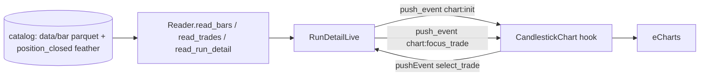

# Design: Run-detail page + candlestick chart (Phase 2)

**Date:** 2026-06-04
**Project:** `nautilus_automatron_ex` — Elixir/Ash/Phoenix LiveView rewrite of `nautilus_automatron`
**Status:** Approved for planning

## Purpose

Phase 2 of the rewrite. Add the run-detail page at `/runs/:run_id`: a
candlestick chart of the run's bars with trade entry/exit overlays, a trade
navigator, and a trades table. Target visual and data-flow parity with the
existing Python/React run-detail page, restricted to the chart and trades.
Indicators, key-levels, viewer-state persistence, and the secondary analysis
charts are Phase 3.

## Scope

### In scope

- `Reader` extensions: `read_bars`, `read_trades`, `read_run_detail`.
- `RunDetailLive` at `/runs/:run_id` (replaces the Phase 1 placeholder).
- `CandlestickChart` JS hook (eCharts); chart data delivered via `push_event`.
- `echarts` added to the asset bundle.
- Read-through data access (no new Postgres tables).
- Trade entry/exit markLines (colored by pnl), trade navigator (prev/next,
  zoom-to-trade), trades table, header (run id, position/fill counts, bar-type
  chips).
- Inert indicator-sidebar shell: layout placeholder labeled Phase 3, no compute.
- Tests: `Reader` unit, cross-language parity (`read_bars`/`read_trades` vs the
  Python `/bars` and `/trades` JSON), LiveView mount.

### Out of scope (Phase 3+)

- Indicator engine (12+ indicators).
- Key-level detectors (25).
- Viewer-state persistence (per-run indicator/detector selections).
- Secondary analysis charts: equity curve, PnL distribution, PnL over time,
  hold-time histogram, trades by month.
- Backtest orchestration (Phase 4), ingestion orchestration (Phase 5).

## Locked decisions (this phase)

| # | Decision | Choice |
|---|---|---|
| 1 | Chart data delivery | LiveView `push_event` over the websocket. The hook builds the same eCharts option as the React app; data arrives via the socket, not REST. No public API. |
| 2 | Data access | Read-through from the catalog per request (as `InstrumentData` does). The `Run` Postgres row stays the dashboard index only; bars/trades are not persisted. |
| 3 | Visual/behavior target | Match the existing app. Minimal change. Port the eCharts option-builder verbatim. |

## Reference: existing implementation (parity source)

Python/React, under `/Users/mordrax/code/nautilus_automatron`:

- Client: `packages/client/src/pages/RunDetailPage.tsx`,
  `components/chart/CandlestickChart.tsx`, `lib/chart-config.ts`,
  `lib/trade-utils.ts`, `types/api.ts`.
- Server: `packages/server/server/routes/runs.py` (`GET /api/runs/{id}`),
  `bars.py` (`GET /api/runs/{id}/bars/{bar_type}`), `fills.py`
  (`GET /api/runs/{id}/trades`); `store/transforms.py` (`bars_to_ohlc`, trade
  projection).

Payload shapes the Elixir backend must reproduce:

- **OhlcData** (columnar): `{datetime: [iso8601], open: [float], high: [float],
  low: [float], close: [float], volume: [float]}`.
- **Trade**: `{relative_id, position_id, instrument_id, direction:
  "Long"|"Short", entry_datetime, entry_price, exit_datetime, exit_price,
  quantity, pnl, currency}`.
- **RunDetail**: `{run_id, config, total_positions, total_fills, bar_types}`.

## Architecture (this phase)

```
lib/automatron_ex/
  catalog/reader.ex                    # + read_bars, read_trades, read_run_detail
lib/automatron_ex_web/
  live/run_detail_live.ex              # replaces the placeholder
assets/
  js/hooks/candlestick_chart.js        # eCharts hook
  package.json                         # + echarts
```

### Data flow



## Components

### 1. `Reader` extensions (pure, no Ash)

- `read_bars(catalog_path, bar_type) :: {:ok, ohlc_map} | {:error, term}` —
  read `data/bar/<bar_type>/*.parquet` (the files `list_instrument_data` already
  scans), concatenate, sort by `ts_event`, project to columnar OHLCV with
  `datetime` as ISO-8601 UTC strings (ns → iso).
- `read_trades(catalog_path, run_id) :: {:ok, [trade_map]} | {:error, term}` —
  read `position_closed_0.feather` (Arrow IPC **stream**), sort by `ts_opened`,
  assign 1-based `relative_id`. Field mapping (confirm against the schema doc and
  Python `fills.py` during implementation): `position_id`, `instrument_id`,
  `direction` from entry side (BUY→Long, SELL→Short), `entry_datetime =
  ts_opened` (iso), `entry_price = avg_px_open`, `exit_datetime = ts_closed`
  (iso), `exit_price = avg_px_close`, `quantity = peak_qty`, `pnl = realized_pnl`
  (2dp), `currency`. Zero-position run → `{:ok, []}`.
- `read_run_detail(catalog_path, run_id) :: {:ok, map} | {:error, term}` —
  reuse `read_run_config`; derive `bar_types` from config; `total_positions` /
  `total_fills` from feather row counts (or the existing `Run` row).

### 2. `RunDetailLive` (`/runs/:run_id`)

- `mount`: load `read_run_detail`. If the run is absent → assign a not-found
  state and render it (no crash). When `connected?`, load bars for
  `bar_types[0]` and trades, then `push_event("chart:init", %{ohlc, trades})`.
- `render`: header (run id, position/fill badges, bar-type chips); chart `div`
  with `phx-hook="CandlestickChart"` and a stable `id`; trade navigator
  (prev/next, current index / total); trades table (relative_id, direction,
  entry/exit, pnl); inert indicator sidebar (disabled, "Phase 3").
- events: `select_trade` (from hook) → assign current index →
  `push_event("chart:focus_trade", %{index})`; `prev_trade` / `next_trade` →
  clamp index, push focus; `select_bar_type` (when >1 bar_type) → reload bars,
  push `chart:init`.

### 3. `CandlestickChart` hook (`assets/js/hooks/candlestick_chart.js`)

- `mounted`: create an eCharts instance on the element. `handleEvent("chart:init",
  {ohlc, trades})` → build option (port `buildOption` + the trade-markLine
  builder from `chart-config.ts` / `trade-utils.ts`) → `setOption`. Register a
  click handler on the trade markLines → `pushEvent("select_trade", {index})`.
  `handleEvent("chart:focus_trade", {index})` → compute a `dataZoom` window
  around the trade's entry/exit and `dispatchAction`. Resize on window resize.
  `destroyed`: dispose the instance.
- Ported option specifics: candlestick series `data` rows `[open, close, low,
  high]`; `itemStyle` up/down colors; trade markLine entry/exit `coord`s, color
  by pnl, `#relative_id` label; `dataZoom` inside + slider; category `xAxis` from
  `ohlc.datetime`; `scale` price `yAxis`.

### 4. Assets

Add `echarts` to `assets/package.json`; import it in `app.js` and register the
`CandlestickChart` hook. esbuild bundles `node_modules`. Confirm the build
succeeds with the added dependency.

## Error handling

- `run_id` not in the catalog → not-found state with a back link; no crash.
- `bar_types` empty or bars missing for the selected type → chart empty-state
  with the reason; header and tables still render.
- Malformed parquet/feather → `{:error, reason}` surfaced for that load; the page
  renders the header and whatever data loaded; logged warning.

## Testing

- **Reader unit** (against `test/support/fixtures/catalog`): `read_bars` returns
  the expected columns and row count for the 5-MINUTE bar type; `read_trades`
  returns 204 rows for `e4599dab` with correct `relative_id` ordering and
  direction/pnl mapping; zero-position run (`017f6297`) → `[]`; `read_run_detail`
  returns `bar_types` and counts.
- **Cross-language parity**: `read_trades` and `read_bars` field-by-field vs the
  Python `/trades` and `/bars` JSON for fixture run `e4599dab` (same method as
  the metrics parity in `nae-46k.8`).
- **LiveView**: mount `/runs/:run_id` with fixture data; assert header counts and
  trades-table rows; `assert_push_event "chart:init"` with the OHLC/trades shape;
  `select_trade` updates the index and pushes `chart:focus_trade`; the not-found
  path renders its message.
- **JS hook**: covered indirectly via the LiveView push-payload assertions;
  eCharts rendering is client-side and verified manually in the demo instance.

## Success criteria

1. `/runs/:run_id` renders the run's candlestick chart from the real catalog.
2. Trade entry/exit overlays match the Python chart (count, positions, colors by
   pnl).
3. `read_trades` and `read_bars` values match the Python `/trades` and `/bars`
   JSON for the same run.
4. Trade navigator (prev/next, zoom-to-trade) and trade-click selection work.
5. Tests pass.

## Open questions / confirm during implementation

- Bars source: confirm the run's bars come from `data/bar/<bar_type>` (shared
  instrument data) and that the run config's `bar_types` name an existing
  `data/bar` directory. Read one and inspect before wiring the projection.
- Trade field mapping: confirm `entry_price`/`exit_price` = `avg_px_open` /
  `avg_px_close` and the direction derivation against Python `fills.py`.
- `echarts` bundle size via esbuild — confirm the build works.
